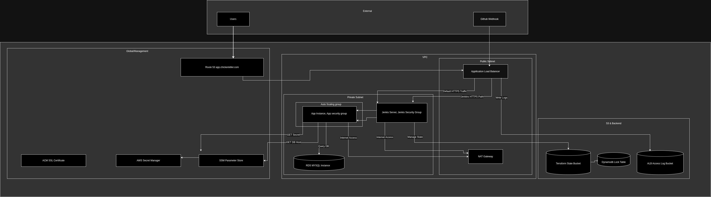

# PipelineVote

A production-ready, highly secure, and fully automated infrastructure for a Spring Boot Java Voting Application.



[](https://www.terraform.io/)
[](https://aws.amazon.com/)
[](https://www.jenkins.io/)

---

## Key Features

- **Multi-Environment Support**: Seamlessly manage `dev`, `staging`, and `prod` using dedicated `.tfvars` configurations.
- **Dynamic Scaling**: Application tier powered by **Auto Scaling Groups (ASG)** for 99.9% availability.
- **Zero-Secrets Policy**: Automated DB credential generation via **AWS Secrets Manager** and endpoint discovery via **SSM**.
- **Edge Security**: Load Balancer protected by **IP Allow Listing** and SSL/TLS termination.
- **Observability**: **ALB Access Logging** enabled with automatic 90-day S3 lifecycle retention.
- **Remote State Management**: Collaborative Terraform state locking using **S3** and **DynamoDB**.

---

## Project Structure

```text
PipelineVote/
├── app/               # Java Spring Boot Application
├── infrastructure/    # IaC & Config Management
│   ├── terraform/     #   - Terraform Modules (VPC, RDS, ALB, ASG)
│   └── ansible/       #   - Automation Playbooks
├── cicd/              # Pipeline Definitions
│   └── Jenkinsfile    #   - Multi-Environment Jenkins Pipeline
├── docs/              # Comprehensive Documentation
│   ├── Architecture.md
│   ├── Deployment.md
│   └── Troubleshooting.md
└── README.md          # Project Overview
```

---

## Quick Start

1. **Configure Infrastructure**:
   ```bash
   cd infrastructure/terraform
   cp terraform.tfvars.example dev.tfvars
   # Fill in your domain_name and zone_id
   ```

2. **Deploy to Dev**:
   ```bash
   terraform apply -var-file=envs/dev.tfvars
   ```

3. **CI/CD Integration**:
   - Create a Jenkins Pipeline job.
   - Point to `cicd/Jenkinsfile`.
   - Run with parameters for automated `plan` and `apply`.

---

## Deep Dive Documentation

- [Architecture Documentation](./docs/Architecture.md): Explore the design decisions and data flows.
- [Deployment Guide](./docs/Deployment.md): Step-by-step instructions for a clean setup.
- [Troubleshooting](./docs/Troubleshooting.md): Common issues and how to fix them.

---

## Security Note

This project strictly follows the **Principle of Least Privilege**. All compute resources are isolated in private subnets, and access is managed via restricted IAM policies and security group white-listing.
